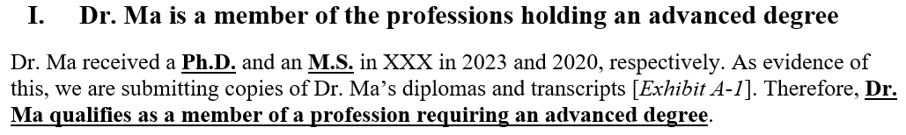
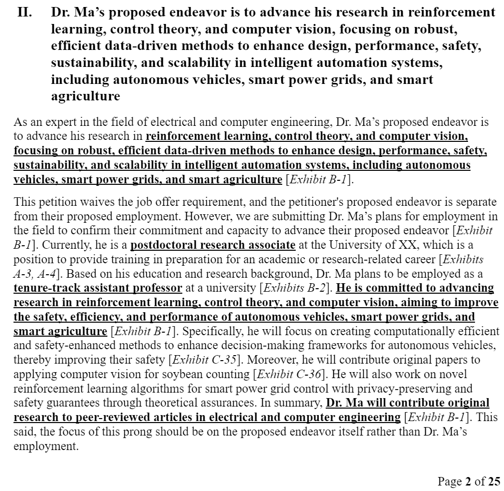
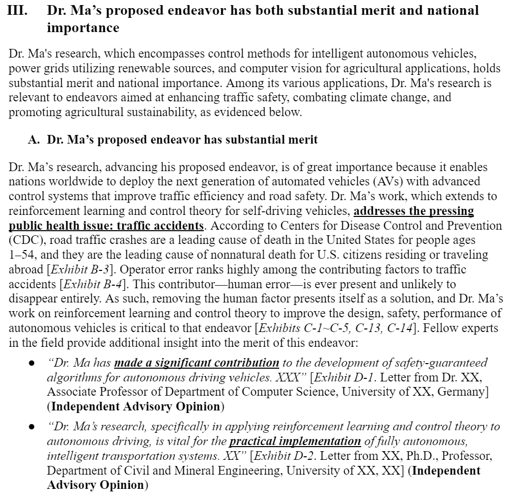
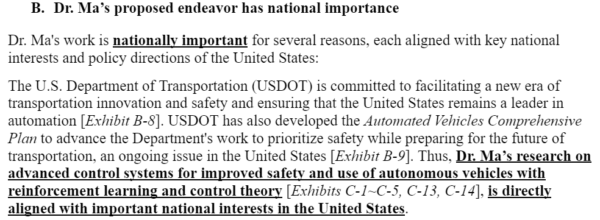
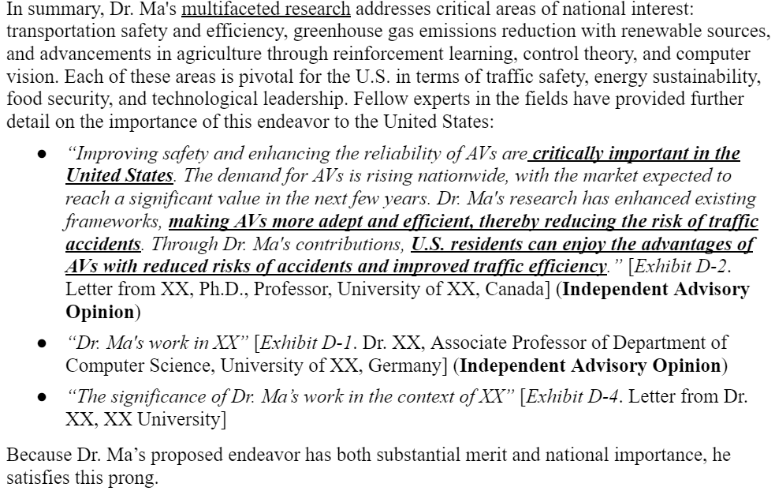
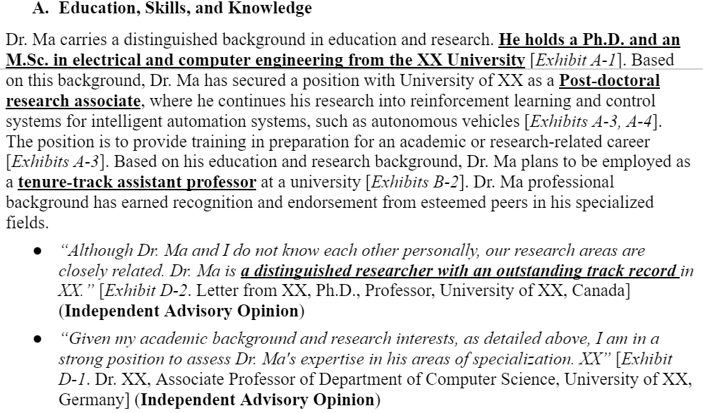
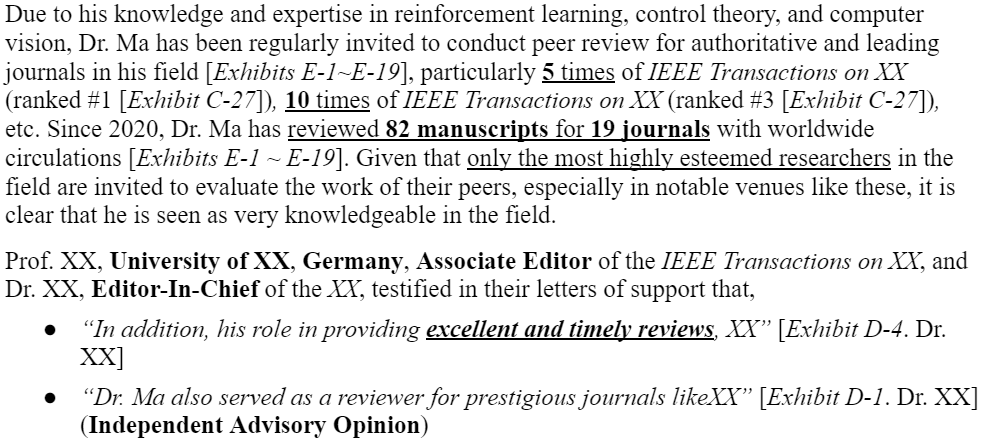
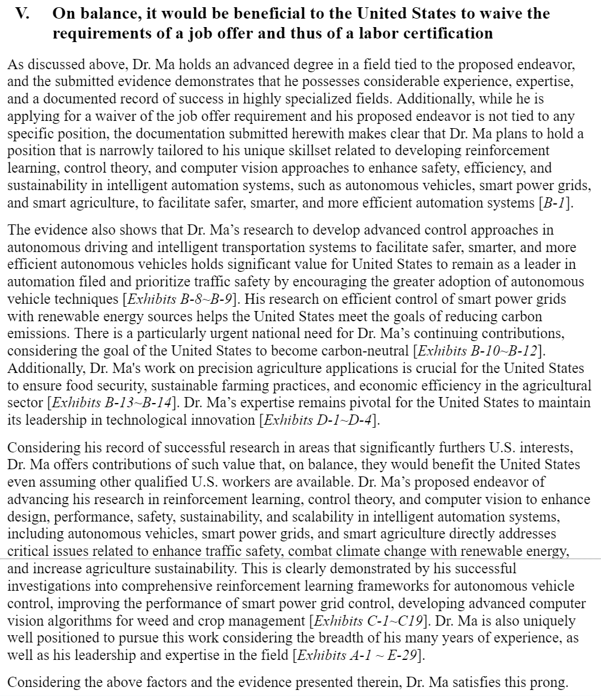
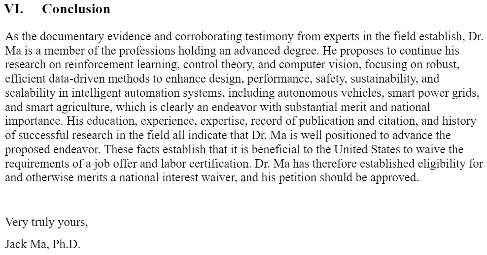

# NIW-EB1A
This repo contains information about how to DIY NIW (EB1A will be out if I pass it). **All materials and notes are based on my own experience, thus it may not be true for everyone! Thanks to my friends who supported me during the process of applying to NIW.**

## If you have any questions (e.g., Can I apply? how to write xxx sections), please file an issue on GitHub, as it may be also helpful to others. 

# Common Questions?
- **Why DIY for NIW**: it is easier than writing an academic paper.
- **How long will it take**: it takes about 1 week to 1 month to prepare the materials depending on how many papers/citations you need to summarize (excluding the waiting time for recommendation letters). For myself, I have 460 citations, so it took me more than 2 weeks to finish.
- **When should I start**: Papers >= 2~3 (at least 1 first author?), citations >= 20, reviews >= 10. The more you have, the higher probability you will pass.
- **Any difference between TSC and NSC**: personally, i think no.

## Contents
* [Useful Resources](#useful-resources)
* [Preparation](#preparation)
* [Main Story](#main-story)
     * [Items included in the mail](#items-included-in-the-mail)
     * [Petition Letter](#petition-letter)

# Useful Resources

**Official Website**: please read the official instructions before you ask for questions.
- Chapter 5 - Advanced Degree or Exceptional Ability: https://www.uscis.gov/policy-manual/volume-6-part-f-chapter-5.
- Direct Filing Addresses for Form I-140, Immigrant Petition for Alien Worker: https://www.uscis.gov/forms/all-forms/direct-filing-addresses-for-form-i-140-immigrant-petition-for-alien-worker.
- Tips for Filing Forms by Mail: https://www.uscis.gov/forms/filing-guidance/tips-for-filing-forms-by-mail.

**Website for checking other cases' status**: 
- Quick View of USCIS Progress: https://hilites.today/.

# Preparation
- Recommendation letters: prepare ahead since some of the professors may be too busy to respond. I have 4 RLs, 2 dependent and 2 independent. Some of my friends have 1 dependent and 2 dependent.
- Petition letter: the key letter to show why you will be beneficial to the United States.

# Main Story
## Items included in the mail
**The forms are not difficult to fill (1-2 hours?). Make sure you sign the forms, otherwise it will be returned. Make sure you put enough information they need**
- G-1145 clipped to the front (if you want electrical notification): https://www.uscis.gov/g-1145.
- Cover Letter: find it in the repo (docs/PL_CoverLetter.pdf).
- Form I-140 and check: https://www.uscis.gov/i-140.
- Form I-907 and check (if you apply for premium processing): https://www.uscis.gov/i-907.
- Form ETA-9089 (two copies, I do not know why, but others suggested, so prepared the same two copies; I ONLY completed J, K, L, and M sections)
- Petition letter: described below
- Index of exhibits (a sample can be found at docs/0_IndexOfExhibit.pdf)
- Supporting Documents (Exhibits)

## Petition Letter
The petition letter is the most important item in the application and requires you to put in most of your time. I attached the contents inside the PL (docs/Contents of PL.pdf). The key contents (six sections) of the petition letter are to prove that:
- Section I: Dr. Ma is a member of the professions holding an advanced degree;
- Section II: What is Dr. Ma’s proposed endeavor;
- Section III: Dr. Ma’s proposed endeavor has both substantial merit and national importance;
- Section IV: Dr. Ma is well-positioned to advance the proposed endeavor;
- Section V: On balance, it would be beneficial to the United States to waive the requirements of a job offer and thus of a labor certification;
- Section VI: Conclusion

### Section I: Dr. Ma is a member of the professions holding an advanced degree
Attaching the degrees you earned. If you do not have a degree in the US, then you may need to translate the documents.

     

### Section II: What is Dr. Ma’s proposed endeavor
Since I have three different research fields, thus I combined them with a loooong endeavor to cover all the research fields.

     

### Section III: Dr. Ma’s proposed endeavor has both substantial merit and national importance
This section is very important! You need to illustrate why your research is crucial to the US. The proof should be specific and you need to find specific policies or data (search via Google, e.g., AI for autonomous driving US government policies) to support your arguments. I have three different research fields. Here is one of the examples that illustrates why my research on autonomous driving has substantial merit.

     

Following is an example to show why my research on autonomous driving is also of national importance:

     

Lastly, do not forget to summarize this section:

     

### Section IV: Dr. Ma is well-positioned to advance the proposed endeavor
This section is also a very important section to show how you meet the criterion. In this section, you need to show your works: citations, papers, international impact, etc.

#### Education, Skills, and Knowledge
Again, show your educational background.

     

Also, we may show your reviews in this subsection as follows:

     

#### Record of Success in Related or Similar Efforts and Interest of Relevant Individuals
In this section, you may show:
- Dr. Ma’s research has been published in some of the top publication venues in his field
- Researchers from around the world have relied upon Dr. Ma’s research to further their own investigations in the field
- At least x of Dr. Ma’s papers are among the most highly cited in the field of Engineering for their years of publication
- Dr. Ma’s research is highly novel and influential in his field
- Dr. Ma has been playing leading and active roles in the scientific community

### Section V: On balance, it would be beneficial to the United States to waive the requirements of a job offer and thus of a labor certification
Actually, this section just follows the framework and that's enough.

     

### Section VI: Conclusion
Summarize the petition letter.

     

     

